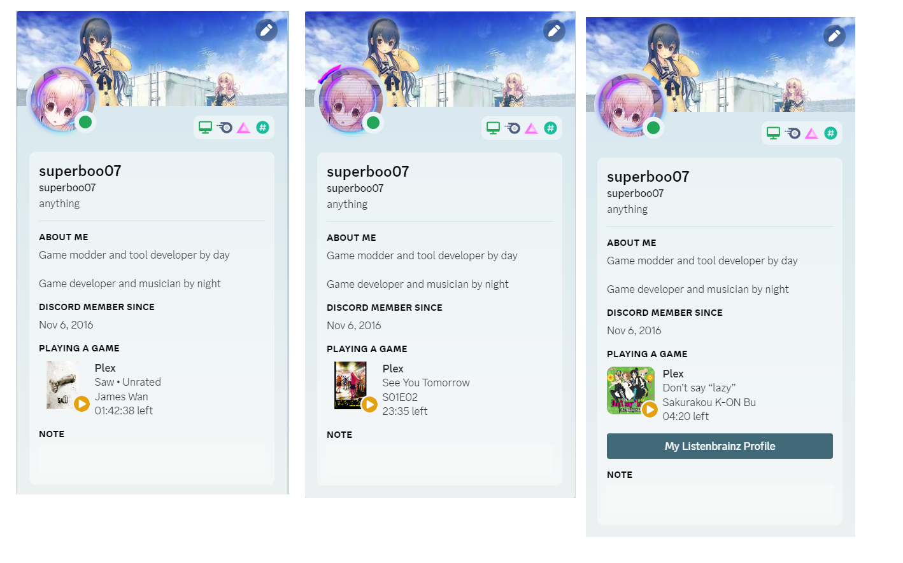

# Discord Rich Presence for Plex



Discord Rich Presence for Plex is a Python script which displays your [Plex](https://www.plex.tv/) status on [Discord](https://discord.com/) using [Rich Presence](https://discord.com/developers/docs/rich-presence/how-to).

This is an enhanced fork written by superboo07. If you have any issues with the features added please make an issue request on this page, and not the orginal.

## Installation

1. Install [Python](https://www.python.org/downloads/) (version 3.10 or newer) - Make sure to tick "Add Python to PATH" during the installation.
2. Download the [latest release](https://github.com/phin05/discord-rich-presence-plex/releases/latest) of this script.
3. Extract the directory contained in the above ZIP file.
4. Navigate a command-line interface (cmd, PowerShell, bash, etc.) into the above-extracted directory.
5. Start the script by running `python main.py`.

When the script runs for the first time, a directory named `data` will be created in the current working directory along with a `config.yaml` file inside of it. You will be prompted to complete authentication to allow the script to retrieve an access token for your Plex account.

The script must be running on the same machine as your Discord client.

## Configuration

The config file is stored in a directory named `data`.

### Supported Formats

* YAML - `config.yaml` / `config.yml`
* JSON - `config.json`

### Reference

* `logging`
  * `debug` (boolean, default: `true`) - Outputs additional debug-helpful information to the console if enabled.
  * `writeToFile` (boolean, default: `false`) - Writes console output to a `console.log` file in the `data` directory if enabled.
* `display` - Display settings for Rich Presence
  * `hideTotalTime` (boolean, default: `false`) - Hides the total duration of the media if enabled.
  * `useRemainingTime` (boolean, default: `false`) - Displays the media's remaining time instead of elapsed time if enabled.
  * `posters`
    * `enabled` (boolean, default: `false`) - Displays media posters if enabled. Requires `imgurClientID`.
    * `imgurClientID` (string, default: `""`) - [Obtention Instructions](#obtaining-an-imgur-client-id)
    * `maxSize` (int, default: `256`) - Maximum width and maximum height to use while downscaling posters before uploading them.
  * `buttons` (list) - [Information](#buttons)
    * `label` (string) - The label to be displayed on the button.
    * `url` (string) - A web address or a [dynamic URL placeholder](#dynamic-button-urls).
    * `mediaTypes` (list, optional) - If set, the button is displayed only for the specified media types. Valid media types are `movie`, `episode`, `live_episode`, `track` and `clip`.
* `users` (list)
  * `token` (string) - An access token associated with your Plex account. ([X-Plex-Token](https://support.plex.tv/articles/204059436-finding-an-authentication-token-x-plex-token/), [Authenticating with Plex](https://forums.plex.tv/t/authenticating-with-plex/609370))
  * `servers` (list)
    * `name` (string) - Name of the Plex Media Server you wish to connect to.
    * `listenForUser` (string, optional) - The script reacts to alerts originating only from this username. Defaults to the parent user's username if not set.
    * `blacklistedLibraries` (list, optional) - Alerts originating from libraries in this list are ignored.
    * `whitelistedLibraries` (list, optional) - If set, alerts originating from libraries that are not in this list are ignored.
    * `ipcPipeNumber` (int, optional) - A number in the range of `0-9` to specify the Discord IPC pipe to connect to. Defaults to `-1`, which specifies that the first existing pipe in the range should be used. When a Discord client is launched, it binds to the first unbound pipe number, which is typically `0`.

### Obtaining an Imgur client ID

1. Go to Imgur's [application registration page](https://api.imgur.com/oauth2/addclient).
2. Enter any name for the application and pick OAuth2 without a callback URL as the authorisation type.
3. Submit the form to obtain your application's client ID.

### Buttons

Discord can display up to 2 buttons in your Rich Presence.

Due to a strange Discord bug, these buttons may be unresponsive or exhibit strange behaviour towards your own clicks, but other users are able to click on them to open their corresponding URLs.

#### Dynamic Button Labels

Instances of `{title}` in button labels will be replaced with the top-level title of the media being played.

#### Dynamic Button URLs

During runtime, the following dynamic URL placeholders will get replaced with real URLs based on the media being played:

* `dynamic:imdb`
* `dynamic:tmdb`
* `dynamic:thetvdb`
* `dynamic:trakt`
* `dynamic:letterboxd`
* `dynamic:musicbrainz`

### Example (YAML)

```yaml
logging:
  debug: true
  writeToFile: false
display:
  hideTotalTime: false
  useRemainingTime: false
  posters:
    enabled: true
    imgurClientID: 9e9sf637S8bRp4z
    maxSize: 256
  buttons:
    - label: '{title} on IMDb'
      url: dynamic:imdb
    - label: Music Stats
      url: https://github.com
      mediaTypes:
        - track
users:
  - token: HPbrz2NhfLRjU888Rrdt
    servers:
      - name: Bob's Home Media Server
      - name: A Friend's Server
        whitelistedLibraries:
          - Movies
```

## Configuration - Discord

The "Display current activity as a status message" setting must be enabled in Discord Settings → Activity Settings → Activity Privacy.


## Configuration - Environment Variables

* `DRPP_PLEX_SERVER_NAME_INPUT` - This is used only during the initial setup (when there are no users in the config) as the name of the Plex server to be added to the config file after user authentication. If this isn't set, in interactive environments, the user is prompted for an input, and in non-interactive environments, "ServerName" is used as a placeholder, which can later be changed by editing the config file and restarting the script.
* `DRPP_NO_PIP_INSTALL` - Set this to `true` to skip automatic invocation of pip on script startup to install missing dependencies.